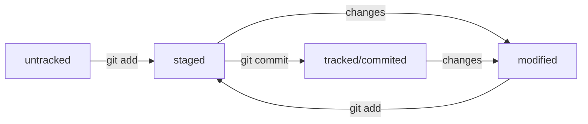

# Intro to Git

## Installing GIT
Install GIT for Windows

Change .gitconfig

```git config --global user.name "User Namovich"``` - имя или ник нужно написать латиницей и в кавычках

```git config --global user.email username@yandex.ru``` - здесь нужно указать свой настоящий email

```git config --list``` - show gitconfig

## Shell and basic shell commands

Here is basic shell commands? we use in lesson

```cd``` - change directory. ```cd ~``` - change to home directory

```pwd``` - show my place (where i am)

```ls``` - list directory

```mkdir``` - make directory

```rmdir``` - remove directory

```touch``` - create file

```cat``` - list file

```cp``` - copy file

```mv``` - move file

```rm``` - remove file or folder

```clip < file.txt```  - copt file to clipboard

## GIT commands

```git init``` - initialize git repositary in folder

```rm -rf .git``` - remove git from folder

```git status``` - current status of repositary

```git add``` - add file to repositary, ```git add --all``` - add all files in folder

```git commit -m 'Comment'``` - Commit changes

```git log``` - show all commits

```git remote add name link``` - link local and remote repositary

```git remote -v``` - show link to remote repositary

```git push -u origin master``` - put local repositary content to remote

```git push``` - move commit to remote repositary

## GitHub
Register in GitHub

Create SSH keys

Put you public key in settings

Create new repositary

Link you git repositary to github

```git remote add origin git@github.com:%ИМЯ_АККАУНТА%/first-project.git```

origin - name of remote repositary

Put local repositary content to remote

## Hash and other
Every commit has it's own hash/ Anyone can see it using comands ```git log```  or ```git log --oneline``` (short version).

```HEAD``` is a last commit in branch?
```cat ./git/HEAD``` - show reference to master file. 
```cat ./git/refs/heads/main``` show hash of the last commit.

## File statuses in Git
File can be in next statuses
untracked - not in git
staged (indexed, cached) - prepared to commit
tracked - watched by Git
modified - changed after commit

When you add file to git and then change it, youo need to add file again.



```git status``` show statuses for staged, modified, untracked files/


## README.md
File about project in markdown format.

Read about Markdown [here](https://gist.github.com/fomvasss/8dd8cd7f88c67a4e3727f9d39224a84c "on Github") or [there](https://www.markdownguide.org/cheat-sheet/ "Markdown")

